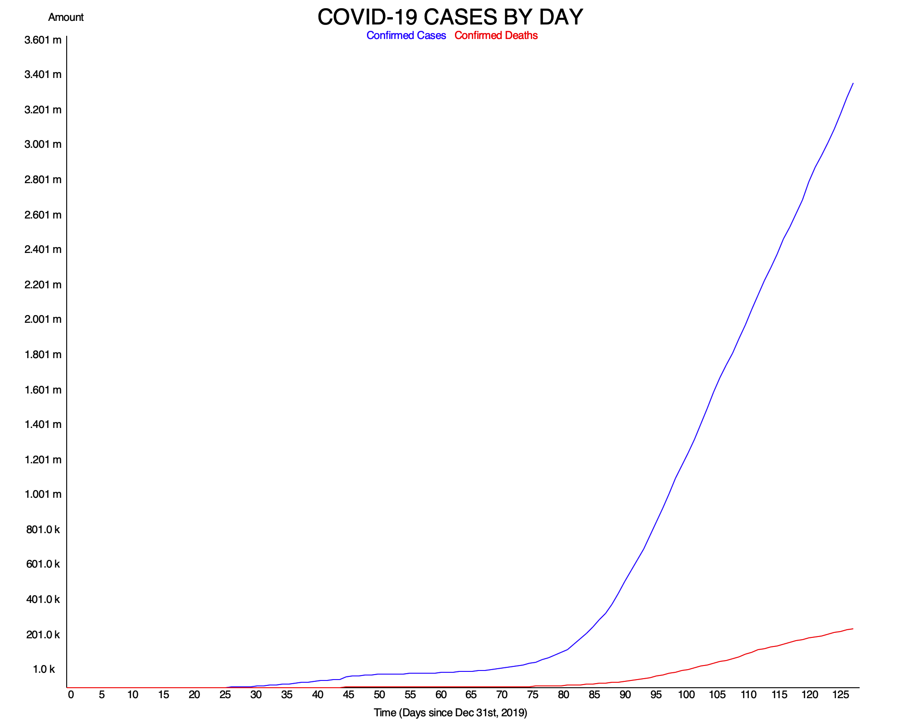

# Covid-19 Grapher
 I wrote this program to graph confirmed cases and deaths from Covid-19 with the intent of leaving it open-ended.
 I will temporarily update the .txt file and rerun the program to keep the graph most up-to-date.
 
 The current graph as of May 3, 2020 contains all statistics up to May 3, 2020.
 
 
 The statistics were obtained from Eli Blaney's GitHub Seir Repo and OurWorldInData, where I read in the files to create 2-D lists to
 make the graph.

The graphics.py module was provided by John Zelle in his Intoduction to Computer Programming book Python Programming.
